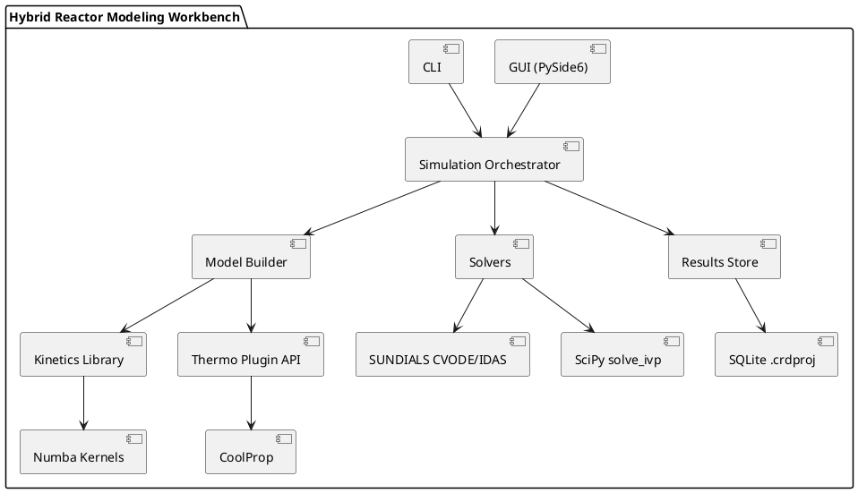

# SPEC-1 Hybrid Reactor Modeling Workbench

## Background

Industrial reactor design relies on numerically solving material, energy, and momentum balances using **user-supplied kinetics and transport models**. Existing CRD tools excel at balance-solving and scenario analysis but do **not** discover chemistry or mechanisms. Practitioners need a focused workbench that:

- Treats **kinetics as first-class data** (from experiments, literature, or microkinetic reductions), with provenance and uncertainty.
- Supports **semi-empirical/lumped models** (power-law, Langmuir–Hinshelwood, Eley–Rideal) alongside modular thermodynamics and transport correlations.
- Solves **PFR/CSTR/packed-bed** balances (adiabatic/isothermal/heat-exchanged; single/1D-axial gradients) and reports conversion, selectivity, temperature, and pressure-drop profiles.
- Makes **assumptions explicit** (flow patterns, mixing, effectiveness factors) and allows sensitivity/identifiability analysis to expose when predictions hinge on weak data.
- Integrates with external tools (DFT/microkinetic packages, data labs) without claiming mechanistic discovery.

> The goal: a pragmatic, engineering-grade modeling workbench that connects validated kinetics to scalable reactor designs, emphasizing transparency over black-box prediction.

## Method

### Architecture (MVP)

- Desktop stack: Python 3.11+, PySide6 GUI, CLI entrypoints (Typer).
- Numerics: SciPy `solve_ivp` (BDF/LSODA) for stiff ODEs; optional SUNDIALS CVODE/IDAS via CasADi or native bindings for performance/sensitivities; NumPy for arrays; Numba for rate kernels.
- Thermo: Built‑in ideal/Raoult for MVP; optional CoolProp plugin for properties.
- Persistence: Single‑file SQLite project (`.crdproj`) with JSON fields for flexible parameter payloads; all results cached as columnar tables.
- Extensibility: Plugin registry for thermo and kinetics; ChemKin‑like import/export; unit registry (Pint) for conversions.

#### Component Diagram (PlantUML)



### Reactor Models & Equations

#### CSTR (single/parallel reactions, jacketed)

State vector: x = [C1..CN, T, Tj].

- Material balance: V * dCi/dt = Fi,in − Fi,out + V * ri(C,T)
- Energy balance (bulk): rho * Cp * V * dT/dt = sum(Fj,in * hj,in) − sum(Fj,out * hj,out) + V * sum(-ΔHk * rk) − U * A * (T − Tj)
- Jacket energy: mj * Cpj * dTj/dt = Qin − U * A * (T − Tj)

#### PFR (tube), 1D axial (method of lines)

Discretize z in [0, L] into nodes. For node m:

- Species: dFi/dz = ri(C,T) * Ac
- Energy: dT/dz = ( - sum(ΔHk * rk) * Ac − hw * Pw * (T − Tw) ) / sum(Fj * Cpj)
- Wall/Jacket: dTw/dz = ( hw * Pw * (T − Tw) − hj * Pw * (Tw − Tj) ) / (m_w * Cpw / L)
- Pressure drop (Ergun): dP/dz = −[ 150*(1−eps)^2/eps^3 * mu * u/dp^2 + 1.75*(1−eps)/eps^3 * rho * u^2/dp ], u = FT * R * T / (P * Ac)

#### Packed‑bed (PBR) in catalyst weight W

- Species: dFi/dW = ri'(C,T)   (rates per kg‑cat)
- Energy: dT/dW = ( − sum(rk' * ΔHk) − a * U * (T − Tj) ) / sum(Fj * Cpj)
- Link to axial form via dW = (1−eps) * rho_p * Ac * dz

### Kinetics & Transport

- Kinetic forms:
  - Power‑law: r = k * Π Ci^(ni)
  - LHHW/Eley–Rideal: r = [ k * Π Ci^(alpha_i) ] / [ (1 + Σ Kj * Cj)^m ] with Arrhenius k = A * exp(-Ea/RT), van’t Hoff for K.
- External films (packed bed):
  - Heat: Nu = 2 + 1.1 * Rep * Pr^(1/3)
  - Mass: Sh = 2 + 1.1 * Rep * Sc^(1/3)
    where Rep = rho * ui * dp / mu, ui = u / eps.
- Intraparticle effectiveness (spherical pellet), first‑order closed form:
  - Thiele: phi = Rp * sqrt(keff / Deff)
  - eta = (3 / phi) * (coth(phi) − 1/phi)
  - For non‑first‑order LHHW, MVP uses local linearization about surface concentration; future option: radial micro‑model.

### Solvers & Algorithms

- Discretization: method‑of‑lines for PFR/PBR (upwind for convection). Adaptive node refinement when |ΔT| between nodes exceeds threshold.
- Time/space integration:
  - ODEs: SciPy `solve_ivp(method='BDF'|'LSODA')`.
  - Optional high‑performance: SUNDIALS CVODE (forward/adjoint sensitivities), IDAS for DAEs.
- Events: ignition/extinction via root functions on dT/dz, dX/dz turning points.
- Estimation: Weighted nonlinear least squares (`scipy.optimize.least_squares`, TRF) with bounds; global seed via Differential Evolution; MCMC (emcee) for credible intervals.
- Sensitivity/identifiability: finite‑difference or CVODES forward sensitivities; Fisher matrix, parameter correlation.

#### Solver Sequence (PlantUML)

```plantuml
@startuml
actor User
User -> GUI: Define species, reactions, kinetics, thermo, unit model
GUI -> Orchestrator: Build model DAG
Orchestrator -> Thermo: property callbacks (Cp, H, mu, k)
Orchestrator -> Kinetics: evaluate rates & Jacobians (Numba)
Orchestrator -> Solver: integrate ODE/DAE (CVODE/solve_ivp)
Solver --> Orchestrator: profiles (z, F_i, T, P, T_w)
Orchestrator -> Results Store: persist run + manifest
Orchestrator --> GUI: plots (X,S, T(z), P(z)) + audit report
@enduml
```

### Data Model (SQLite DDL excerpt)

```sql
CREATE TABLE project (
  id INTEGER PRIMARY KEY, name TEXT NOT NULL, created_utc TEXT, notes TEXT
);
CREATE TABLE species (
  id INTEGER PRIMARY KEY, project_id INTEGER, name TEXT, formula TEXT, phase TEXT,
  UNIQUE(project_id,name)
);
CREATE TABLE reaction (
  id INTEGER PRIMARY KEY, project_id INTEGER, name TEXT, reversible INTEGER DEFAULT 0,
  stoich JSON -- e.g., {"A": -1, "B": -1, "C": 1}
);
CREATE TABLE kinetic_model (
  id INTEGER PRIMARY KEY, reaction_id INTEGER, type TEXT, -- POWER_LAW, LHHW, ER
  params JSON, -- {"A":...,"Ea":...,"exponents":{...},"Ki":{...}}
  covariance JSON, units JSON, source TEXT -- DOI/report, lab notebook ref
);
CREATE TABLE experiment (
  id INTEGER PRIMARY KEY, project_id INTEGER, kind TEXT, conditions JSON,
  data BLOB -- columnar (Parquet) or CSV payload
);
CREATE TABLE run (
  id INTEGER PRIMARY KEY, project_id INTEGER, model JSON, solver JSON,
  manifest JSON, started TEXT, duration_ms INTEGER
);
CREATE TABLE profile (
  run_id INTEGER, x REAL, var TEXT, value REAL, unit TEXT,
  PRIMARY KEY (run_id, x, var)
);
CREATE TABLE summary (
  run_id INTEGER PRIMARY KEY, conversion JSON, selectivity JSON, hotspots JSON
);
```

### File/Interchange

- Project file: SQLite + metadata; export CSV/Parquet results; import CSV/Excel experiments.
- ChemKin‑like import/export for reactions/thermo; JSON schema for kinetics with unit tags.

## Implementation

1. Project skeleton
   - Repo, packaging, CI; schema migrations; unit registry (Pint); manifest spec.
2. Core kinetics API
   - Data classes for reactions/parameters; Numba‑compiled rate kernels; Arrhenius/van’t Hoff helpers.
3. Thermo MVP
   - Ideal Cp(T) polynomials, ΔHrxn(T) from ΔHf°. Plugin interface; optional CoolProp adapter.
4. Unit models
   - CSTR balances + jacket.
   - PFR/PBR method‑of‑lines, Ergun ΔP, wall/jacket coupling; adaptive axial meshing.
5. Solvers
   - SciPy ODE path; CasADi/SUNDIALS path (sensitivities) behind feature flag.
6. Estimation & Uncertainty
   - Weighted least squares; residual diagnostics; DE global seeding; MCMC (emcee) for intervals.
7. GUI (PySide6) + CLI
   - Model builder wizards; parameter tables with units; plotter; run manager; audit report.
8. Persistence & export
   - SQLite I/O; run caching; CSV/PNG exports.
9. Validation suite
   - Benchmark cases (CSTR multiple steady states; adiabatic PFR hot‑spot; packed‑bed ΔP scaling).
10. Packaging
    - Windows/macOS installers; signed binaries; offline docs.

## Milestones

- M1 – Core numerics (4 wks): PFR/CSTR solvers with SciPy; Ergun; ideal thermo; CLI runs; CSV export.
- M2 – GUI alpha (3 wks): Model builder, plotting, run manifest; unit handling; simple reports.
- M3 – Estimation (3 wks): Nonlinear regression, residual plots; DE seeding; summaries.
- M4 – Packed‑bed polishing (3 wks): Film correlations, effectiveness factor; hot‑spot detection; adaptive mesh.
- M5 – SUNDIALS path (3 wks): CVODE/IDAS option + sensitivities; performance bench; caching.
- M6 – Validation & packaging (2 wks): Regression tests on benchmark cases; installers; offline docs.

## Gathering Results

- Numerical accuracy: mass/energy closure < 0.5%; invariants tracked; compare against analytical/benchmark solutions.
- Physical fidelity: reproduce literature bench cases (conversion, T‑profile, ΔP) within ±5% using provided kinetics.
- Parameter fit quality: residual normality tests; confidence/credible intervals; identifiability flags for high correlation.
- Performance: packed‑bed 1000‑node case < 5 s on 8‑core/16 GB laptop; report includes solver stats.
- Auditability: each run stores equations solved, tolerances, model versions, and full inputs for reproduction.
